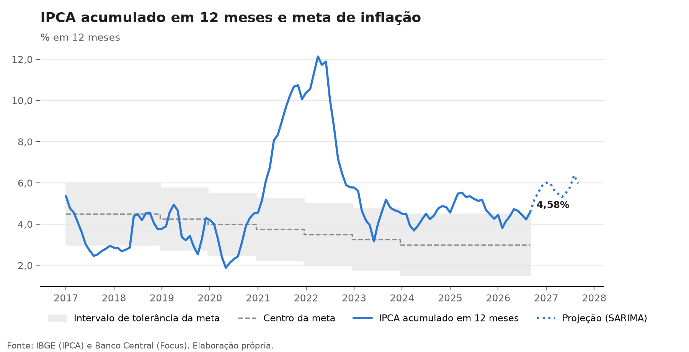

# Monitor de inflação: IPCA, contribuições e projeção de curto prazo

Acompanhamento mensal do IPCA com atualização automática: coleta os dados do IBGE e as expectativas do Focus, decompõe a inflação por grupos, projeta os próximos meses e compara a projeção com o consenso de mercado.

📄 **[Nota do último mês](nota/ultima_nota.md)**



---

## O que o monitor responde

1. **Como veio o último IPCA em relação ao esperado?** A surpresa é medida contra a mediana do Focus coletada no meio do mês de referência.
2. **O que puxou a inflação?** A contribuição de cada grupo (peso × variação) separa choques de alimentos, preços administrados, combustíveis e serviços.
3. **Para onde vai a inflação em 12 meses, e onde fica em relação à meta?** Projeção mensal com intervalo de confiança, acumulada em 12 meses e comparada ao centro e ao teto da meta.
4. **O modelo é útil?** As previsões são avaliadas fora da amostra contra o Focus, que é a referência que o mercado usa.

## Método

| Etapa | Como é feita |
|---|---|
| **Coleta** | API do SIDRA/IBGE (tabelas 1737 e 7060) e API Olinda do Banco Central (expectativas mensais do Focus) |
| **Decomposição** | Contribuição do grupo $g$ no mês $t$: $c_{g,t} = w_{g,t} \cdot \pi_{g,t} / 100$, em que $w$ é o peso e $\pi$ a variação do grupo. A soma das contribuições é conferida contra o índice geral a cada execução |
| **Projeção** | SARIMA(1,0,1)(1,0,1)₁₂ estimado de 2004 em diante, com intervalo de 80%, e um modelo sazonal simples como referência |
| **Avaliação** | Previsões um passo à frente nos últimos 36 meses, em janela crescente. O Focus usado é o coletado na metade do mês, quando o IPCA anterior já é conhecido, o mesmo conjunto de informação dos modelos |

Os modelos são univariados e servem de referência quantitativa. O Focus tende a superá-los no curto prazo, porque incorpora informação que eles não têm: prévias como o IPCA-15, preços coletados em alta frequência, anúncios de reajuste de preços administrados.

**Resultado da avaliação (36 meses até ago/26):** o Focus erra, em média, cerca de 0,15 p.p. por mês (RMSE), menos que o modelo sazonal simples (0,25 p.p.) e o SARIMA (0,28 p.p.). O SARIMA não supera a referência sazonal, o que sugere que o padrão autorregressivo da série acrescenta pouco à sazonalidade nesse período. O próximo passo natural é um modelo com informação de fora da série, como o IPCA-15 e os preços administrados. A tabela atualizada a cada mês está na [nota](nota/ultima_nota.md#desempenho-fora-da-amostra).

## Atualização automática

Um workflow do GitHub Actions ([`atualizar.yml`](.github/workflows/atualizar.yml)) roda nos dias de divulgação do IPCA (8 a 15 de cada mês) e toda segunda-feira, depois da pesquisa Focus. Ele executa os testes, coleta os dados, regenera gráficos, tabelas e nota, e publica as mudanças no repositório.

## Estrutura

```
├── src/
│   ├── coleta.py        # SIDRA e Focus
│   ├── analise.py       # acumulados, contribuições, projeção e avaliação
│   ├── graficos.py
│   └── main.py          # executa tudo e escreve a nota
├── tests/               # teste de ponta a ponta com respostas simuladas das APIs
├── data/                # dados coletados (CSV)
├── output/
│   ├── figuras/
│   └── tabelas/         # contribuições, projeção, métricas e conferência da decomposição
└── nota/
    ├── ultima_nota.md   # gerada automaticamente
    └── leitura.md       # análise escrita pelo autor, incorporada à nota
```

## Como reproduzir

```bash
pip install -r requirements.txt
python src/main.py               # coleta e gera tudo
python src/main.py --sem-coleta  # recalcula a partir dos CSVs em data/
python -m pytest tests           # testes
```

## Próximos passos

- Núcleos de inflação e índice de difusão, a partir dos subitens.
- Modelo com variáveis explicativas: IPCA-15, câmbio, preços de commodities agrícolas e de energia.
- Projeção por grupos (bottom-up), com hipóteses explícitas para preços administrados.

## Autor

**Alexandre Saldanha**, economista e mestrando em População, Território e Estatísticas Públicas (ENCE/IBGE).
[LinkedIn](https://www.linkedin.com/in/alexandre-saldanha-202a8592/) · [Lattes](http://lattes.cnpq.br/5148309722351266)

Código sob licença [MIT](LICENSE). Dados: IBGE e Banco Central do Brasil.
