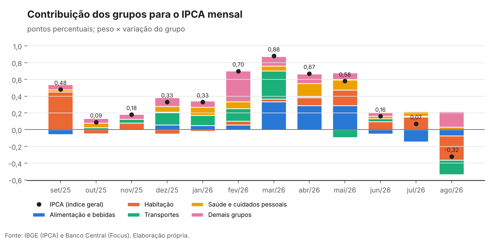
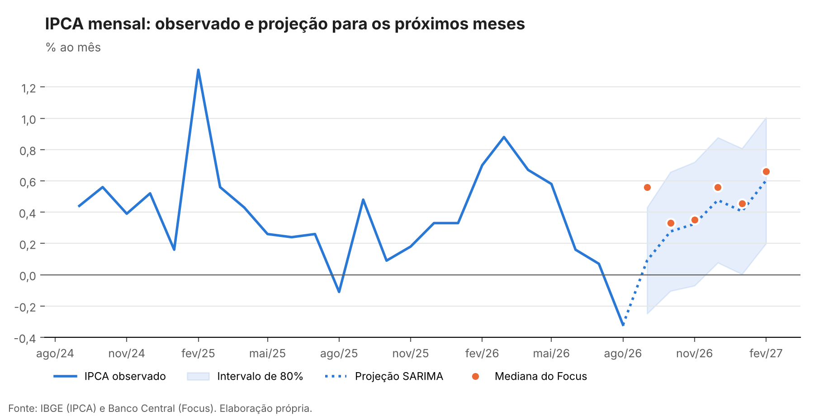

# Monitor de inflação: IPCA de ago/26

*Atualizado automaticamente após a divulgação do IPCA pelo IBGE.*

## Destaques

- **IPCA de ago/26: -0,32%.** A mediana do Focus coletada no meio do mês esperava -0,17%: surpresa de -0,15 p.p.
- **Acumulado em 12 meses: 4,22%**, para uma meta de 3,0% e teto de 4,5%.
- **Acumulado no ano: 3,11%.**
- **Inflação projetada para os próximos 12 meses (SARIMA, até ago/27): 4,59%.**

## Leitura

*Leitura referente ao IPCA de agosto de 2026.*

A deflação de 0,32% em agosto veio de preços administrados e de alimentos, e não de uma desaceleração mais ampla. Habitação foi o principal vetor, com contribuição de −0,29 p.p.: a energia elétrica caiu 7,63% com o Bônus de Itaipu creditado nas faturas do mês. Transportes contribuiu com −0,17 p.p., com a queda das passagens aéreas e dos combustíveis, e Alimentação e bebidas com −0,07 p.p., com a queda dos alimentos in natura. No sentido contrário, Despesas pessoais somou +0,13 p.p., quase tudo pelo reajuste do cigarro.

O resultado ficou abaixo da mediana do Focus coletada no meio do mês, e o acumulado em 12 meses recuou para 4,22%, consolidando o retorno ao intervalo de tolerância da meta depois de ter ficado acima do teto de 4,5% em junho. A melhora, porém, depende em boa parte de um fator que não se repete: o bônus é um crédito pontual, e a tarifa de energia volta ao nível anterior nas faturas seguintes.

Essa é a principal razão da distância entre as projeções para setembro: o SARIMA espera 0,09% e o Focus, 0,56%. O modelo é univariado e lê a deflação de agosto como informação sobre a tendência; o mercado incorpora a reversão do bônus. O caso ilustra o limite do modelo puramente estatístico em meses dominados por preços administrados e reforça o próximo passo do projeto: incluir variáveis de fora da série, como o IPCA-15 e o calendário de reajustes.

*Fonte dos itens: IBGE, divulgação do IPCA de agosto de 2026.*

## Contribuições por grupo

| Grupo | ago/26 (p.p.) | Soma dos últimos 12 meses (p.p.) |
|---|---:|---:|
| Alimentação e bebidas | -0,07 | 0,74 |
| Habitação | -0,29 | 0,74 |
| Transportes | -0,17 | 0,62 |
| Saúde e cuidados pessoais | 0,03 | 0,78 |
| Demais grupos | 0,19 | 1,26 |

## Projeção

| Mês | SARIMA (%) | Intervalo de 80% | Focus, mediana (%) | Acumulado em 12 meses, SARIMA (%) |
|---|---:|---:|---:|---:|
| set/26 | 0,09 | -0,25 a 0,43 | 0,56 | 3,82 |
| out/26 | 0,28 | -0,10 a 0,66 | 0,33 | 4,01 |
| nov/26 | 0,32 | -0,07 a 0,72 | 0,35 | 4,16 |
| dez/26 | 0,48 | 0,08 a 0,88 | 0,56 | 4,32 |
| jan/27 | 0,41 | 0,00 a 0,81 | 0,46 | 4,39 |
| fev/27 | 0,60 | 0,20 a 1,01 | 0,66 | 4,29 |

### Desempenho fora da amostra

Previsões um passo à frente nos últimos 36 meses, em pontos percentuais. A mediana do Focus é a coletada na metade do mês de referência, quando o IPCA do mês anterior já é conhecido, o mesmo conjunto de informação dos modelos.

| Modelo | RMSE | MAE | Viés |
|---|---:|---:|---:|
| Mediana do Focus | 0,147 | 0,112 | -0,009 |
| Sazonal simples | 0,246 | 0,198 | 0,001 |
| SARIMA | 0,279 | 0,205 | 0,045 |

