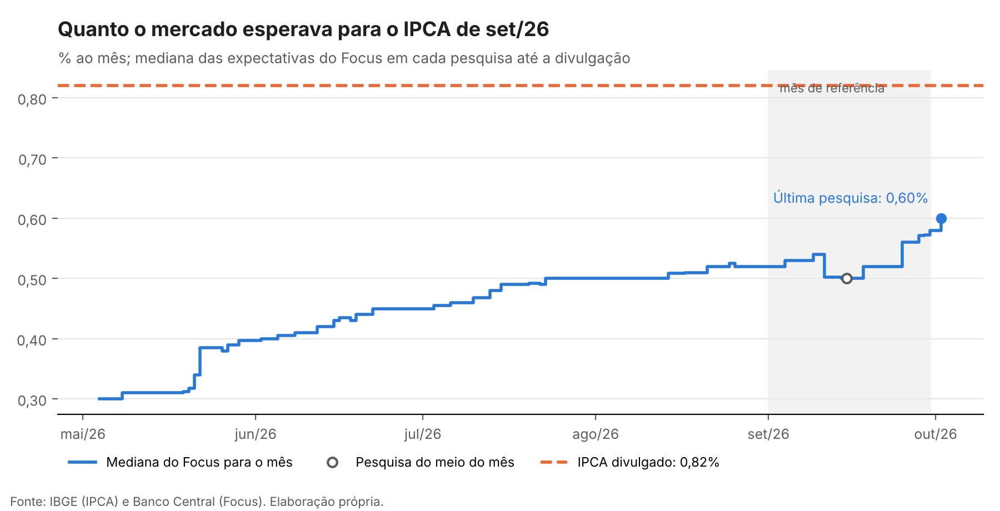
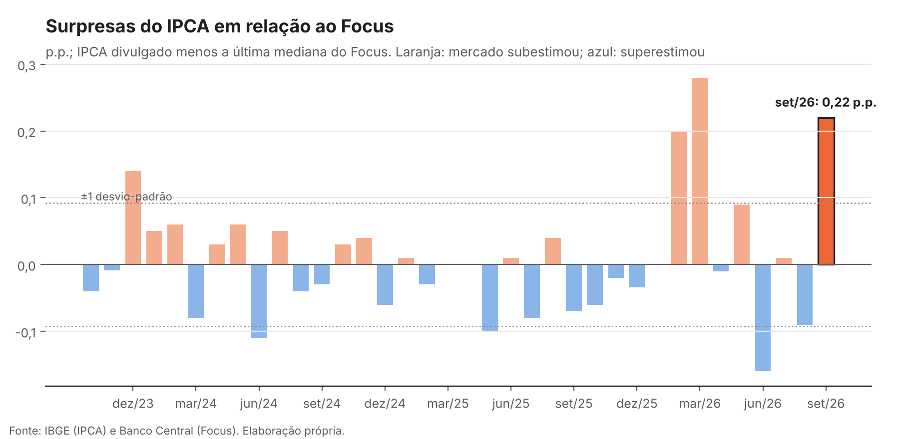

# Monitor de inflação: IPCA de set/26

*Atualizado automaticamente após a divulgação do IPCA pelo IBGE.*

## Destaques

- **IPCA de set/26: 0,82%.** A mediana do Focus coletada no meio do mês esperava 0,50%: surpresa de 0,32 p.p.
- **Acumulado em 12 meses: 4,58%**, para uma meta de 3,0% e teto de 4,5% (acima do teto).
- **Acumulado no ano: 3,95%.**
- **Inflação projetada para os próximos 12 meses (SARIMA, até set/27): 5,97%.**

## Leitura

*Leitura referente ao IPCA de setembro de 2026.*

O IPCA subiu 0,82% em setembro, puxado por três grupos que somaram 0,71 p.p., quase 90% do índice. Habitação liderou, com 0,35 p.p.: a energia elétrica subiu 7,98% com o fim do Bônus de Itaipu e foi o maior impacto individual do mês. Alimentação e bebidas contribuiu com 0,18 p.p., com a alimentação no domicílio em alta de 0,96%, concentrada em tomate, batata, cebola e arroz, enquanto o frango caiu. Transportes somou outros 0,18 p.p., com passagens aéreas (9,66%) e combustíveis (1,41%, com etanol a 3,16% e gasolina a 1,21%).

Fora desses três grupos, a alta foi moderada: os outros seis somaram 0,11 p.p., com Saúde e cuidados pessoais (0,08%) e Educação (0,04%) praticamente estáveis. O resultado do mês é, portanto, concentrado em preços administrados, alimentos in natura e itens voláteis, e não um avanço disseminado.

Com o resultado, o acumulado em 12 meses foi a 4,58%, acima do teto de 4,5%, e o acumulado no ano a 3,95%. O índice superou em 0,32 p.p. a mediana do Focus coletada no meio do mês (0,50%). Para outubro, o Focus espera 0,32%, e o SARIMA, 0,64%: o modelo univariado tende a projetar a alta de setembro para frente, sem distinguir o choque de energia da tendência, o que reforça o próximo passo do projeto, incluir o IPCA-15 e o calendário de reajustes.

*Fonte dos itens: IBGE, divulgação do IPCA de setembro de 2026.*

## Contribuições por grupo

| Grupo | set/26 (p.p.) | Soma dos últimos 12 meses (p.p.) |
|---|---:|---:|
| Alimentação e bebidas | 0,18 | 0,98 |
| Habitação | 0,35 | 0,64 |
| Transportes | 0,18 | 0,79 |
| Saúde e cuidados pessoais | 0,01 | 0,76 |
| Demais grupos | 0,10 | 1,30 |

## Projeção

| Mês | SARIMA (%) | Intervalo de 80% | Focus, mediana (%) | Acumulado em 12 meses, SARIMA (%) |
|---|---:|---:|---:|---:|
| out/26 | 0,64 | 0,30 a 0,99 | 0,32 | 5,15 |
| nov/26 | 0,55 | 0,17 a 0,93 | 0,35 | 5,54 |
| dez/26 | 0,62 | 0,23 a 1,02 | 0,56 | 5,85 |
| jan/27 | 0,49 | 0,09 a 0,89 | 0,45 | 6,02 |
| fev/27 | 0,67 | 0,27 a 1,07 | 0,66 | 5,98 |
| mar/27 | 0,58 | 0,18 a 0,99 | 0,41 | 5,67 |

### Desempenho fora da amostra

Previsões um passo à frente nos últimos 36 meses, em pontos percentuais. A mediana do Focus é a coletada na metade do mês de referência, quando o IPCA do mês anterior já é conhecido, o mesmo conjunto de informação dos modelos.

| Modelo | RMSE | MAE | Viés |
|---|---:|---:|---:|
| Mediana do Focus | 0,155 | 0,117 | -0,021 |
| Sazonal simples | 0,263 | 0,212 | -0,015 |
| SARIMA | 0,304 | 0,223 | 0,022 |

## Precisão do Focus

- **Surpresa de set/26: 0,22 p.p.** em relação à última pesquisa disponível antes da divulgação (0,60%), e 0,32 p.p. em relação à do meio do mês.
- Em módulo, é a 2ª maior surpresa dos últimos 36 meses. O desvio-padrão das surpresas no período é de 0,09 p.p., e o viés médio, de 0,01 p.p.
- O mercado subestimou o IPCA neste mês, invertendo o sinal do erro anterior.

